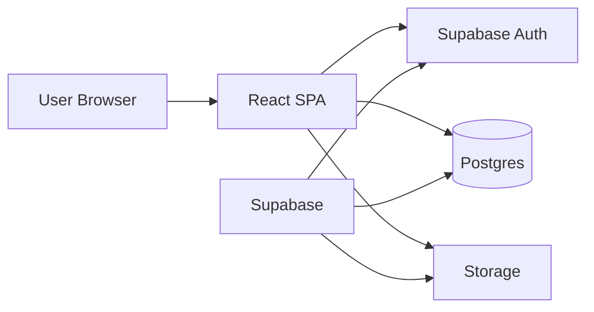
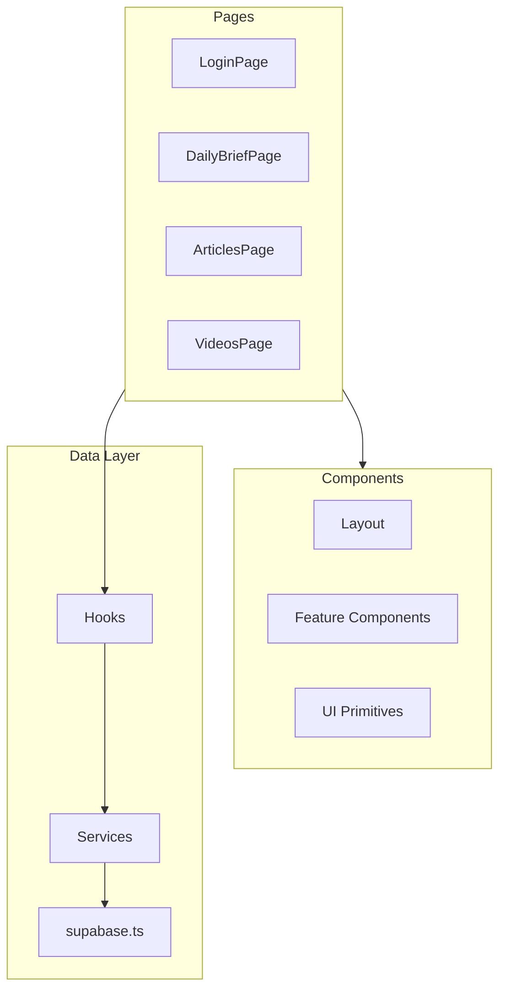
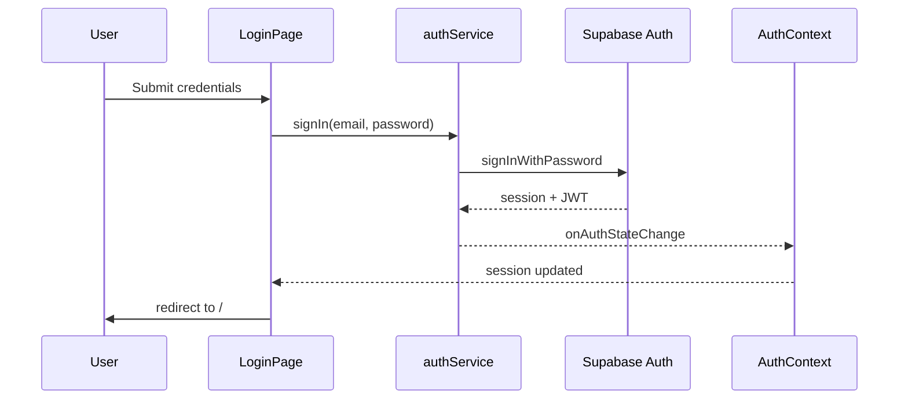

# MX Intelligence — Architecture

## System Context

MX Intelligence is a client-heavy SPA. Supabase provides authentication, relational data, and optional file storage. No custom Node backend is required for MVP.



---

## Frontend Layers



### Principles

1. **Pages are thin** — compose components and hooks; no direct Supabase calls in pages.
2. **Services are pure async** — one function per operation; map DB rows to domain types.
3. **Types at boundaries** — `database.ts` from Supabase CLI; domain types in `types/`.
4. **Auth at the edge** — `AuthGuard` + `AuthProvider` wrap protected routes.

---

## Authentication Flow



### Session handling

- `AuthProvider` subscribes to `supabase.auth.onAuthStateChange`.
- Initial load: `getSession()` before rendering protected routes.
- Logout: `signOut()` clears client session and redirects to `/login`.

### Route protection

```
App
├── PublicLayout (centered card)
│   ├── /login
│   └── /signup
└── ProtectedLayout (AppShell) — AuthGuard
    ├── /
    ├── /articles
    └── /videos
```

---

## State Management

| State type | Solution |
|------------|----------|
| Auth session | `AuthContext` |
| Server data | Custom hooks (`useArticles`, etc.) with local state |
| URL state | React Router search params (filters, pagination) |
| Theme | CSS variables (dark default; no toggle in MVP) |

No Redux/Zustand for MVP — context + hooks suffice.

---

## Daily Brief Composition

**Option A (MVP):** Client-side aggregation in `briefService`:

1. Fetch articles where `published_at` is today (or last 24h) + user bookmarks.
2. Fetch videos similarly.
3. Return `{ articles, videos, generatedAt }`.

**Option B (scale):** Supabase Edge Function `get-daily-brief`:

- Runs SQL with joins to `user_preferences`.
- Caches per user/date in a `daily_briefs` table.
- Frontend calls `supabase.functions.invoke('get-daily-brief')`.

Start with Option A; migrate to B when personalization grows.

---

## Error & Loading UX

- Every hook exposes `{ data, error, isLoading, refetch }`.
- `ErrorBoundary` at app root for render errors.
- Service errors map Supabase codes to user-friendly strings in a small `lib/errors.ts` (phase 1.5).

---

## Build & Deploy

| Piece | Target |
|-------|--------|
| Frontend | Vercel, Netlify, or Cloudflare Pages |
| Supabase | Hosted project (prod + optional local via CLI) |
| Env | `VITE_*` vars in host dashboard |

CI (phase 2): GitHub Actions — lint, typecheck, test on PR.

---

## Future Extensions (not MVP)

- Full-text search (Postgres `tsvector` or Supabase pgvector)
- RSS / ingestion pipelines (Edge Functions + cron)
- Mobile PWA
- OAuth providers (Google, GitHub)
- Real-time subscriptions for new content
