# MX Intelligence — Database Plan

Supabase Postgres with Row Level Security (RLS). All tables live in `public` schema unless noted.

---

## Entity Relationship Overview

```mermaid
erDiagram
  auth_users ||--o| profiles : has
  profiles ||--o{ article_reads : tracks
  profiles ||--o{ video_watches : tracks
  profiles ||--o{ bookmarks : saves
  articles ||--o{ article_reads : read_by
  videos ||--o{ video_watches : watched_by
  articles ||--o{ bookmarks : bookmarked
  videos ||--o{ bookmarks : bookmarked

  profiles {
    uuid id PK
    uuid user_id FK
    text display_name
    text avatar_url
    timestamptz created_at
  }

  articles {
    uuid id PK
    text title
    text url
    text source
    text summary
    text[] tags
    int read_time_minutes
    timestamptz published_at
    timestamptz created_at
  }

  videos {
    uuid id PK
    text title
    text url
    text thumbnail_url
    text channel
    int duration_seconds
    text[] tags
    timestamptz published_at
    timestamptz created_at
  }

  article_reads {
    uuid id PK
    uuid user_id FK
    uuid article_id FK
    timestamptz read_at
  }

  video_watches {
    uuid id PK
    uuid user_id FK
    uuid video_id FK
    timestamptz watched_at
  }

  bookmarks {
    uuid id PK
    uuid user_id FK
    text content_type
    uuid content_id
    timestamptz created_at
  }
```



---

## Tables

### `profiles`

Extends `auth.users` with app-specific fields.

| Column | Type | Notes |
|--------|------|-------|
| `id` | `uuid` PK | Same as `auth.users.id` |
| `display_name` | `text` | Optional |
| `avatar_url` | `text` | Optional |
| `created_at` | `timestamptz` | Default `now()` |

**Trigger:** `on_auth_user_created` → insert profile row on signup.

---

### `articles`

Curated or ingested articles. MVP: seed data + manual admin inserts.

| Column | Type | Notes |
|--------|------|-------|
| `id` | `uuid` PK | `gen_random_uuid()` |
| `title` | `text` NOT NULL | |
| `url` | `text` NOT NULL UNIQUE | External link |
| `source` | `text` | Publisher name |
| `summary` | `text` | Short blurb for cards |
| `tags` | `text[]` | Default `{}` |
| `read_time_minutes` | `int` | Optional |
| `published_at` | `timestamptz` | For daily brief filtering |
| `created_at` | `timestamptz` | Default `now()` |

**Indexes:** `published_at DESC`, GIN on `tags`.

---

### `videos`

| Column | Type | Notes |
|--------|------|-------|
| `id` | `uuid` PK | |
| `title` | `text` NOT NULL | |
| `url` | `text` NOT NULL UNIQUE | YouTube etc. |
| `thumbnail_url` | `text` | |
| `channel` | `text` | |
| `duration_seconds` | `int` | |
| `tags` | `text[]` | |
| `published_at` | `timestamptz` | |
| `created_at` | `timestamptz` | |

**Indexes:** `published_at DESC`, GIN on `tags`.

---

### `article_reads`

Per-user read tracking.

| Column | Type | Notes |
|--------|------|-------|
| `id` | `uuid` PK | |
| `user_id` | `uuid` FK → `auth.users` | |
| `article_id` | `uuid` FK → `articles` | |
| `read_at` | `timestamptz` | Default `now()` |

**Unique:** `(user_id, article_id)`.

---

### `video_watches`

| Column | Type | Notes |
|--------|------|-------|
| `id` | `uuid` PK | |
| `user_id` | `uuid` FK → `auth.users` | |
| `video_id` | `uuid` FK → `videos` | |
| `watched_at` | `timestamptz` | Default `now()` |

**Unique:** `(user_id, video_id)`.

---

### `bookmarks` (phase 1.5)

| Column | Type | Notes |
|--------|------|-------|
| `id` | `uuid` PK | |
| `user_id` | `uuid` FK | |
| `content_type` | `text` | `'article'` or `'video'` |
| `content_id` | `uuid` | Polymorphic reference |
| `created_at` | `timestamptz` | |

**Unique:** `(user_id, content_type, content_id)`.

---

## Row Level Security Policies

### `profiles`

| Policy | Operation | Rule |
|--------|-----------|------|
| Users read own profile | SELECT | `auth.uid() = id` |
| Users update own profile | UPDATE | `auth.uid() = id` |

### `articles`, `videos` (content tables)

| Policy | Operation | Rule |
|--------|-----------|------|
| Authenticated read all | SELECT | `auth.role() = 'authenticated'` |

Content is shared catalog; ingestion uses service role or dashboard.

### `article_reads`, `video_watches`, `bookmarks`

| Policy | Operation | Rule |
|--------|-----------|------|
| Own rows SELECT | SELECT | `auth.uid() = user_id` |
| Own rows INSERT | INSERT | `auth.uid() = user_id` |
| Own rows UPDATE | UPDATE | `auth.uid() = user_id` |
| Own rows DELETE | DELETE | `auth.uid() = user_id` |

---

## Migrations Plan

| File | Contents |
|------|----------|
| `001_profiles.sql` | `profiles` table, trigger on `auth.users` |
| `002_content.sql` | `articles`, `videos` + indexes |
| `003_user_activity.sql` | `article_reads`, `video_watches` |
| `004_rls.sql` | Enable RLS + all policies |
| `005_bookmarks.sql` | Bookmarks table + RLS (phase 1.5) |

Run locally: `supabase db push` or apply via Supabase dashboard SQL editor.

---

## Type Generation

After migrations:

```bash
supabase gen types typescript --project-id <id> > src/types/database.ts
```

Map rows to domain types in `article.ts`, `video.ts`, `brief.ts`.

---

## Seed Data (`supabase/seed/seed.sql`)

- 10–15 sample articles ( varied sources, tags, `published_at` spread over last 7 days).
- 8–10 sample videos with placeholder thumbnails.
- No user seed — create test user via signup in dev.

---

## Service Layer ↔ Table Mapping

| Service method | SQL / Supabase call |
|----------------|---------------------|
| `articleService.list(filters)` | `.from('articles').select('*').order('published_at')` + filter builder |
| `articleService.markRead(id)` | Upsert `article_reads` |
| `videoService.list(filters)` | Same pattern on `videos` |
| `videoService.markWatched(id)` | Upsert `video_watches` |
| `briefService.getDailyBrief()` | Articles/videos where `published_at >= start_of_day` + join reads for unread badge |

---

## Storage (optional, phase 2)

| Bucket | Use |
|--------|-----|
| `avatars` | User profile images; RLS: user can upload to own folder |

Not required for MVP (use external avatar URLs or Gravatar).

---

## Backup & Ops

- Supabase automatic daily backups on Pro plan.
- Document project ref and migration order in README.
- Never use service role key in frontend.
