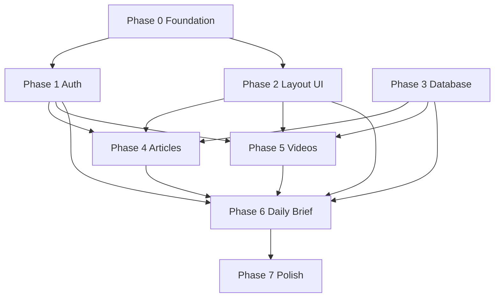

# MX Intelligence — Development Roadmap

Phased delivery from empty repo to usable personal intelligence app. Estimates assume one developer, part-time (~2–3 days per phase).

---

## Phase 0 — Foundation (Days 1–2)

**Goal:** Runnable shell with tooling and Supabase project wired.

| Task | Deliverable |
|------|-------------|
| Init Vite + React + TypeScript | `package.json`, `vite.config.ts`, `tsconfig.json` |
| ESLint + Prettier | Consistent code style |
| Tailwind or CSS variables setup | `src/styles/globals.css`, `tokens.css` |
| Create Supabase project | URL + anon key in `.env.example` |
| `lib/supabase.ts` | Client singleton |
| Basic `App.tsx` + React Router | Route stubs |
| README | Setup instructions |

**Exit criteria:** `npm run dev` loads placeholder routes; env vars documented.

---

## Phase 1 — Authentication (Days 3–4)

**Goal:** Users can sign up, log in, and access protected pages.

| Task | Deliverable |
|------|-------------|
| Migration `001_profiles.sql` | Profiles + signup trigger |
| `AuthContext` + `useAuth` | Session persistence |
| `authService` | signIn, signUp, signOut |
| `LoginPage`, `SignUpPage` | Forms + validation |
| `AuthGuard` | Protect main layout |
| `LoginForm`, `SignUpForm` | Auth components |
| Public vs protected layouts | Route split |

**Exit criteria:** Signup creates profile; logout returns to login; refresh keeps session.

---

## Phase 2 — Layout & Dark UI (Days 5–6)

**Goal:** Polished app chrome matching design system.

| Task | Deliverable |
|------|-------------|
| Design tokens | Dark palette in CSS |
| UI primitives | Button, Input, Card, Badge, Skeleton |
| `AppShell`, `Sidebar`, `Header` | Navigation |
| `PageContainer` | Layout consistency |
| Responsive sidebar / mobile nav | Breakpoint behavior |
| `LoadingSpinner`, `EmptyState` | Common components |

**Exit criteria:** Navigate between stub pages with consistent dark UI; active nav state works.

---

## Phase 3 — Database & Content (Days 7–9)

**Goal:** Articles and videos in DB with seed data.

| Task | Deliverable |
|------|-------------|
| Migrations `002_content`, `003_user_activity`, `004_rls` | Tables + policies |
| `seed.sql` | Dev content |
| Generate `database.ts` | Supabase types |
| Domain types | `article.ts`, `video.ts` |
| `articleService`, `videoService` | CRUD/list/mark read |

**Exit criteria:** Services return seed articles/videos from local or hosted Supabase.

---

## Phase 4 — Articles Page (Days 10–11)

**Goal:** Full articles browsing experience.

| Task | Deliverable |
|------|-------------|
| `useArticles` hook | Loading/error state |
| `ArticleCard`, `ArticleList` | List UI |
| `ArticleFilters` | Tags, date, source |
| `ArticlesPage` | Page assembly |
| Mark as read on open | `article_reads` upsert |
| External link open | `target="_blank"` |

**Exit criteria:** Filter articles; unread vs read styling; mark read persists.

---

## Phase 5 — Videos Page (Days 12–13)

**Goal:** Parity with articles for video content.

| Task | Deliverable |
|------|-------------|
| `useVideos` hook | Data fetching |
| `VideoCard`, `VideoGrid` | Grid layout |
| `VideoFilters` | Tag/duration filters |
| `VideosPage` | Page assembly |
| Mark watched | `video_watches` |

**Exit criteria:** Video grid with thumbnails; filters work; watched state persists.

---

## Phase 6 — Daily Brief Dashboard (Days 14–16)

**Goal:** Home dashboard aggregates today's intelligence.

| Task | Deliverable |
|------|-------------|
| `briefService.getDailyBrief` | Today’s articles + videos |
| `useDailyBrief` hook | Dashboard data |
| `BriefHeader` | Date, stats (counts) |
| `BriefSection` | Reusable section blocks |
| `QuickStats` | Read/watched today |
| `DailyBriefPage` | Full dashboard |

**Exit criteria:** `/` shows curated today view; links to full articles/videos pages.

---

## Phase 7 — Polish & Hardening (Days 17–19)

**Goal:** Production-ready MVP.

| Task | Deliverable |
|------|-------------|
| `ErrorBoundary` | Graceful failures |
| 404 / catch-all route | Unknown paths |
| Form error messages | Auth UX |
| Accessibility pass | Focus, labels, contrast |
| Performance | Lazy routes, image lazy load |
| Deploy frontend | Vercel/Netlify |
| Supabase prod project | Prod migrations + seed strategy |

**Exit criteria:** Deployed URL; smoke test full user journey.

---

## Phase 8 — Enhancements (Backlog)

| Feature | Priority | Notes |
|---------|----------|-------|
| Bookmarks | High | Migration `005`, UI on cards |
| Settings page | Medium | Profile edit, display name |
| OAuth (Google) | Medium | Supabase provider config |
| Search | Medium | Postgres full-text |
| RSS ingestion | Low | Edge Function + cron |
| Email digest | Low | Resend + Edge Function |
| PWA | Low | vite-plugin-pwa |
| Admin content UI | Low | Internal only |

---

## Dependency Graph

---

## Milestones

| Milestone | Phases | User-visible outcome |
|-----------|--------|----------------------|
| **M1: Auth shell** | 0–2 | Login + dark navigable app |
| **M2: Content MVP** | 3–5 | Browse articles and videos |
| **M3: Intelligence hub** | 6 | Daily Brief dashboard |
| **M4: Launch** | 7 | Deployed production MVP |

---

## Risk Register

| Risk | Mitigation |
|------|------------|
| RLS misconfiguration exposes data | Test with second user account; policy review checklist |
| Empty daily brief | Seed recent `published_at`; fallback "recent" section |
| Supabase rate limits on free tier | Paginate lists; avoid N+1 |
| Thumbnail hotlink breaks | Store `thumbnail_url` in seed; fallback placeholder component |

---

## Definition of Done (MVP)

- [ ] Email/password auth with protected routes
- [ ] Dark UI on all main pages
- [ ] Daily Brief at `/` with today's content
- [ ] Articles page with filters and read tracking
- [ ] Videos page with filters and watch tracking
- [ ] RLS on all tables
- [ ] Deployed frontend + documented local setup
- [ ] No secrets in git
